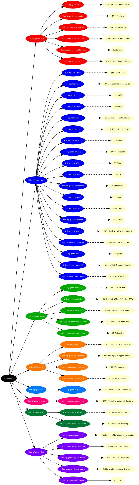

# thi.ng/geom


(https://conventionalcommits.org/)
[](https://discord.gg/JhYcmBw)

Comprehensive and modular geometry toolkit for Clojure/ClojureScript
developed in a literate programming style.

Currently BETA quality, largely stable, but pre-release software. The
libraries have been used in production for several projects, but
further breaking API changes are still forthcoming...

**Note:** This library relies on the new
conditional reader syntax of recent Clojure & Clojurescript versions
and therefore is **not compatible with Clojure versions < 1.7.0**...

## Description & usage

~~See [index.org](src/index.org) for details. Also please note, the
[dev branch](https://github.com/thi-ng/geom/tree/develop) is (as one
might expect) often quite a bit ahead of master and I'm aiming to push
at least weekly snapshots of all modules to
[clojars.org](http://clojars.org)...~~

Update 2018: I gave in to community demand and have converted the project to use
standard CLJC sources and **NOT** rely on org-mode any longer. This
version also constitutes the currently latest version and can be found
in the [no-org branch](https://github.com/thi-ng/geom/tree/feature/no-org/)
of this repo.

## Current Leiningen coordinates

```clj
[thi.ng/geom "1.0.0-RC4"]
```

## Getting started

Tutorials are non-existing so far, but are on the TODO list. However for examples, there are various snippets lingering throughout the codebase and various workshop repos:

https://github.com/thi-ng/geom/blob/master/src/index.org#example-usage
https://github.com/thi-ng/geom/blob/master/geom-viz/src/core.org#example-usage
https://github.com/thi-ng/geom/blob/master/geom-svg/src/examples.org

https://github.com/thi-ng/ws-ldn-1
https://github.com/thi-ng/ws-ldn-2
https://github.com/learn-postspectacular/resonate-workshop-2015
https://github.com/learn-postspectacular/resonate-workshop-2014

https://github.com/cassiel/thi-ng-geom-starter

## Project overview



## License

Copyright © 2013-2015 Karsten Schmidt

Distributed under the
[Apache Software License 2.0](http://www.apache.org/licenses/LICENSE-2.0).
