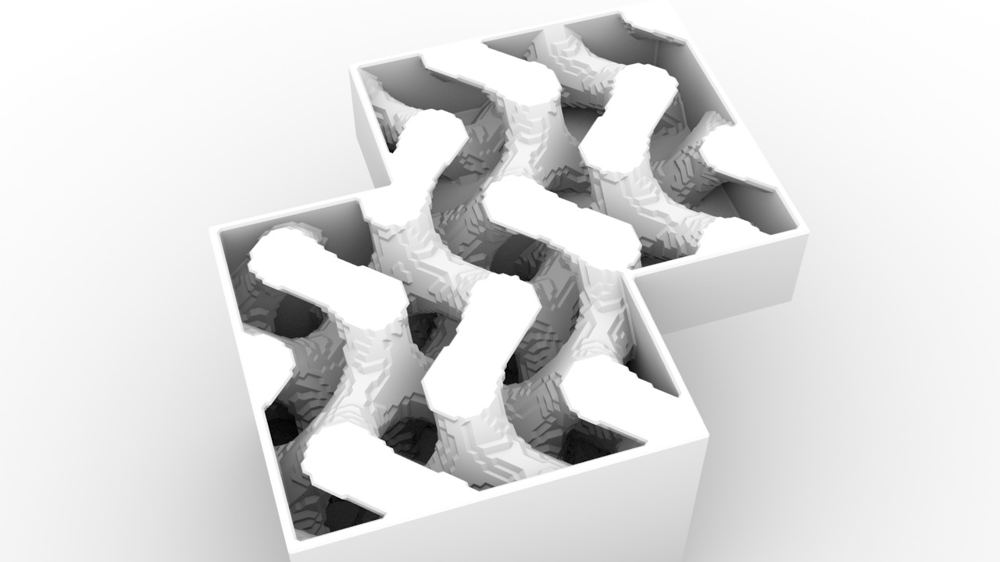

# thi.ng/geom



[](https://gitter.im/thi-ng/geom?utm_source=badge&utm_medium=badge&utm_campaign=pr-badge&utm_content=badge)

Comprehensive and modular geometry toolkit for Clojure/ClojureScript
developed in a literate programming style.

Currently BETA quality, largely stable, but pre-release software. The
libraries have been used in production for several projects, but
further breaking API changes are still forthcoming...

**Note:** This library relies on the new
conditional reader syntax of recent Clojure & Clojurescript versions
and therefore is **not compatible with Clojure versions < 1.7.0**...

## Description & usage

See [index.org](src/index.org) for details. Also please note, the
[dev branch](https://github.com/thi-ng/geom/tree/develop) is (as one
might expect) often quite a bit ahead of master and I'm aiming to push
at least weekly snapshots of all modules to
[clojars.org](http://clojars.org)...

## Current Leiningen coordinates

```clj
[thi.ng/geom "0.0.908"]
```

## License

Copyright © 2013-2015 Karsten Schmidt

Distributed under the
[Apache Software License 2.0](http://www.apache.org/licenses/LICENSE-2.0).
